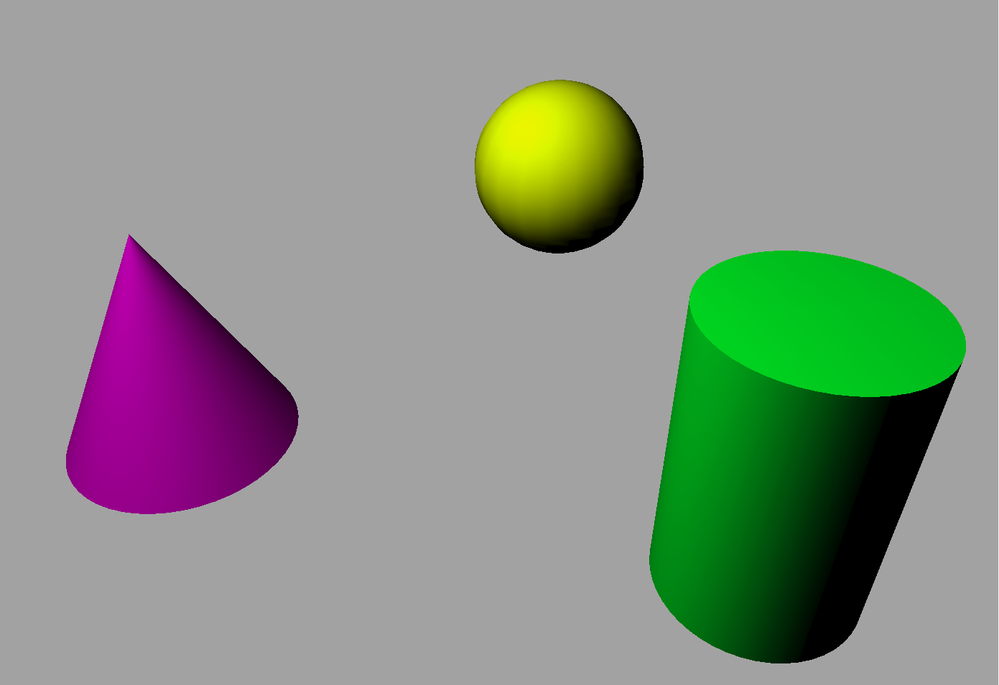
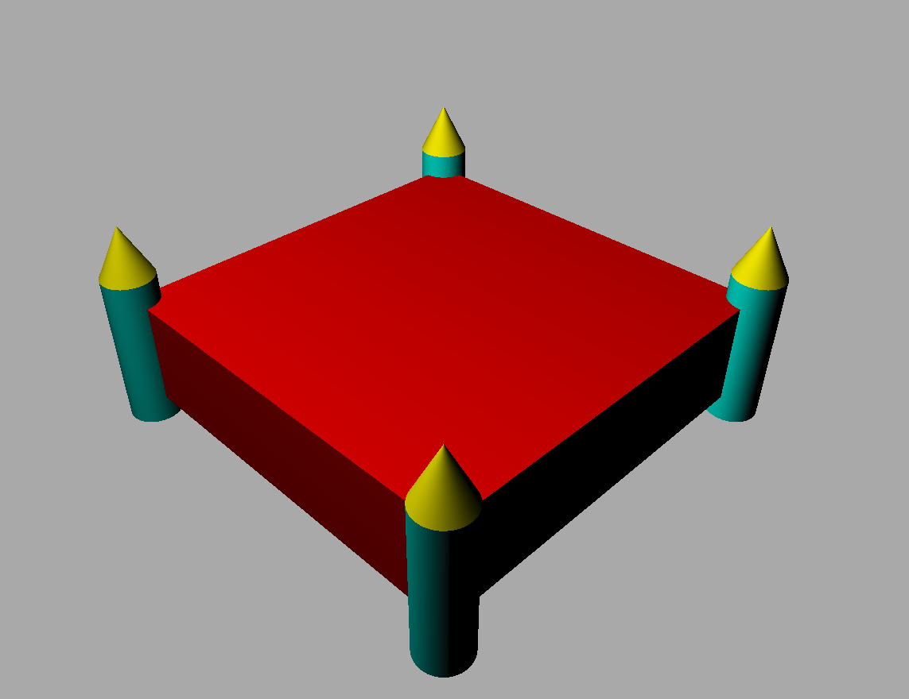

# Programme 02


### Rappel a) et introduction primitives
Les objets graphiques affichés par Three.js sont généralement des maillages triangulaires (mesh en anglais). Three.js considère un "[THREE.Mesh](https://threejs.org/docs/#api/objects/Mesh)" comme une structure contenant deux éléments:
  1. Une forme ([geometry](https://threejs.org/docs/#api/core/Geometry)), généralement une primitive stockée en interne sous la forme d'une liste de sommets (vertices) et d'une liste de faces reliants chacun 3 sommets.
  1. Une apparence ([material](https://threejs.org/docs/#api/materials/Material)). Dans notre cas, il s'agira généralement de la couleur de l'objet. Plus généralement les "matériaux" peuvent aussi contenir des textures et avoir une apparence variable en fonction de la position de la lumière et de la caméra pour donner l'impression d'être brillant, mat, réfléchissants, etc.

THREE.js comprend les géométries des primitives de base :
* cube/pavé droit : [THREE.BoxGeometry](https://threejs.org/docs/#api/en/geometries/BoxGeometry) ( longueur,largeur,hauteur)
* plan : [THREE.PlaneGeometry](https://threejs.org/docs/#api/en/geometries/PlaneGeometry) (largeur, hauteur)
* cylindre : [THREE.Cylinder](https://threejs.org/docs/#api/en/geometries/CylinderGeometry) (rayon sphere du haut, rayon sphere du bas,hauteur,segments radiaux )
* sphere (entière, demi-sphère..) : [THREE.Sphere](https://threejs.org/docs/#api/en/geometries/SphereGeometry)(rayon, segmentsLargeur,segmentsHauteur, phiStart, phiLength, thetaStart, thetaLength)
* cône : [THREE.ConeGeometry](https://threejs.org/docs/#api/en/geometries/ConeGeometry)(rayon, hauteur, segments radiaux, segmentsHauteur)

et bien d'autres

```JavaScript
// Initialisation d'un objet 3D:
const cubeGeometry = new THREE.BoxGeometry( 1,1,1 ); // Primitive cubique de taille 1x1x1 centrée en (0,0,0)
const cubeMaterial = new THREE.MeshLambertMaterial( {color:0xff0000} ); // Couleur rouge
const cubeObject = new THREE.Mesh( cubeGeometry,cubeMaterial ); // Un objet 3D affichable contient une géométrie, et un matériau (~couleur dans ce cas)
cubeObject.position.set(0,0.5,0); // Positionnement de l'objet dans l'espace (par défaut en (0,0,0) ).
sceneGraph.add(cubeObject); // Ajout de l'objet dans le graphe de scène.

```
__Q.___ Placer un cône, un cylindre et une sphère dans la Scène.




__Question Additionnelle__ Créer un château basique en utilisant un pavé droit, 4 cylindres et 4 cônes.



### Changement d'apparence
A la création d'un objet une apparence est initialisée.

 Exemples de quelques attributs d'apparence :
* color : couleur de l'objet
* transparent : true (opacity:0,5): transparence de l'objet
* wireframe: true (affichage des faces de l'objet)

Cette apparence peut évoluer pendant le programme.

```JavaScript
// Création et ajout d'un cube en utilisant le fichier primitives.js

const cubeGeometry = primitives.Cube(centreCube, longueurCote);
const cubeMaterial = new THREE.MeshLambertMaterial( {color:0xff0000} );
const cubeObject = new THREE.Mesh( cubeGeometry,cubeMaterial ); // Un objet 3D affichable contient une géométrie, et un matériau (~couleur dans ce cas)
cubeObject.position.set(0,0.5,0); // Positionnement de l'objet dans l'espace (par défaut en (0,0,0) ).
sceneGraph.add(monCube);

cubeObject.material.color = 0x00ff00; // Changement de couleur de rouge à vert

```
