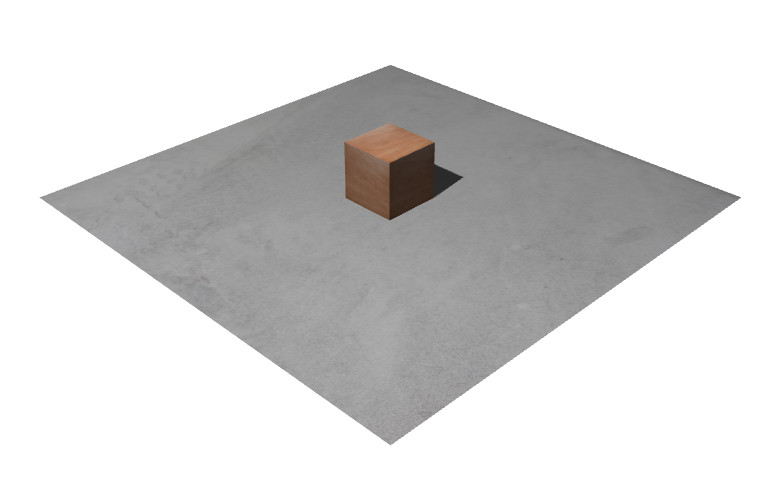

# Texture

## Textures en Three.js

Ce programme présente l'application de textures sur une surface. À titre d'information, l'application d'une texture sur un maillage nécessite deux paramètres:
1. Une image qui va être appliquée sur la surface.
1. Des coordonnées de textures (généralement appelées (u,v), ou (s,t)) associées à chaque sommet du maillage, et qui viennent donner la correspondance entre un sommet donné du maillage, et sa position 2D dans l'espace de l'image.

Les coordonnées de textures sont généralement calculées automatiquement lors de la création de primitives par Three.js, mais peuvent être adaptées au besoin.

Dans le cas du code suivant, on utilise les coordonnées de textures fournies par défaut lors de la création des primitives de Three.js.
Nous devons cependant charger les images qui sont placées dans le répertoire _pictures/_
Three.js propose un chargeur d'image par le biais d'un objet  [TextureLoader](https://threejs.org/docs/#api/loaders/TextureLoader).

__Q.__ Lancez votre navigateur sur le fichier index.html, notez que les objets de la scène apparaissent totalement noirs (c'est normal). Observez les lignes d'erreurs en mode console.
Typiquement:
```
Acces to Image at 'file:///...' has been blocked by CORS policy.
```

Cela signifie que votre navigateur n'a pas réussi à lire l'image depuis le disque dur.

## Chargement d'un fichier externe

### Explication du problème

Pour des raisons de sécurité, un navigateur exécutant du code JavaScript ne peut pas lire par défaut des fichiers présents sur votre disque dur. Plus spécifiquement le protocole permettant de "servir" des fichiers via _file://_ n'est pas autorisé en JavaScript.
Notez que si cela était autorisé, n'importe quelle page web sur internet (plus précisément n'importe quel serveur) contenant du JavaScript que vous visiteriez pourrait, à distance, parcourir et lire le contenu de votre disque dur.

On pourra noter que le principe général de la communication web passe par un schéma dit de client/serveur.
* La partie client correspond au navigateur que vous lancez sur votre machine.
* La partie serveur correspond généralement au code présent sur une machine quelconque dans le monde et dont l'objectif est de fournir les pages HTML et ressources demandées.

Lorsque votre navigateur souhaite visualiser une page web, il envoie une requête au serveur demandant le contenu de cette page.
Le serveur répond avec le contenu de la page (typiquement une page HTML, CSS, ou JavaScript).
Le client analyse ensuite le code, et lorsqu'il rencontre une ressource externe non présente (typiquement une image, un autre fichier de code, etc) il émet de nouvelles requêtes au serveur afin d'obtenir ces fichiers manquants (typiquement suivant le protocole HTTP, ou encore FTP).


L'une des solutions permettant de lire un fichier sur votre disque depuis du code JavaScript consiste à placer votre code sur un serveur web, qui va alors pouvoir "servir" les fichiers demandés par votre client (c-a-d votre navigateur) sous le protocole HTTP.
Il n'est cependant pas nécessaire de placer votre code en ligne sur un serveur externe, différents programmes permettent de lancer de simples serveurs locaux sur votre propre machine.

### Serveur local

_SimpleHTTPServer_ est un code python permettant de lancer un tel serveur.

* Assurez vous tout d'abord que l'interpréteur Python soit installé sur votre machine. Pour cela, vous pouvez taper en ligne de commande:
```
python -V
```
Rem. 
* Sous Windows, la ligne de commande se lance par le programme `cmd`.
* Vous pouvez installer Python librement sur votre ordinateur
  * Sous windows, par le biais d'un téléchargement direct depuis le site [https://www.python.org/](https://www.python.org/)
  * Sous linux, par le biais des packages standards.
* Python est disponible suivant deux versions: 2 et 3. Les deux versions permettent de lancer un serveur.


Une fois que l'interpréteur Python est disponible, placez vous en ligne de commande dans le répertoire racine de votre code, c'est à dire le répertoire `src/`.

Lancez ensuite la commande suivante, dépendant de votre version de Python:

* En Python 2
```
python -m SimpleHHTPServer
```

* En Python 3
```
python -m http.server
```

Ces commandes lancent un serveur local qui vient écouter par défaut le port 8000.

Relancez ensuite votre navigateur en tapant l'adesse suivante dans la barre d'adresse:
```
http://localhost:8000/
```
(notez bien qu'il ne faut plus ouvrir votre navigateur sur le fichier `index.html`, mais directement y accéder par l'adresse localhost).

Vous devriez voir désormais la scène avec les textures. 




 ([similaire à celle-ci](https://htmlpreview.github.io/?https://github.com/drohmer/INF473F/blob/master/seance_02/01_texture/src/index.html)).


### Remarques lors de l'utilisation d'un serveur

* L'utilisation d'un serveur local est très classique en programmation web, et nous devrons utiliser une approche similaire si nous souhaitons pouvoir charger une scène sauvegardée à partir d'un fichier.
* Lorsque votre navigateur lit le code depuis le serveur, il est possible qu'il place en "cache" une partie du code (optimisation par défaut du comportement du navigateur). Il peut alors arriver de modifier le code (par ex. les images de textures), alors que la scène visualisée dans le navigateur reste inchangée même après rechargement de celle-ci.
=> Pensez à vider les données du cache de votre navigateur lorsque vous modifiez votre code (sous Firefox/Chrome raccourci clavier avec CTRL+Shift+Suppr).


## Chargement asynchrone

Notez que _textureLoader.load_ fonctionne en parallèle du reste du code de manière asynchrone. Il s'agit d'un comportement qui évite au navigateur de bloquer lors du chargement de ressources externes.
Cela signifie par contre que les lignes suivantes vont potentiellement s'executer avant que l'image n'ait le temps d'être chargé (comportement non déterministe). Dans le cas présent cela peut impliquer que la scène puisse être affichée noire quelques secondes avant que la texture n'apparaisse. Si la transmission entre le serveur et le client est lente, ce phénomène sera accentué.

Dans certains cas, il sera nécessaire de gérer spécifiquement le temps d'attente et de ne pas supposer que les données soient immédiatement disponibles.
